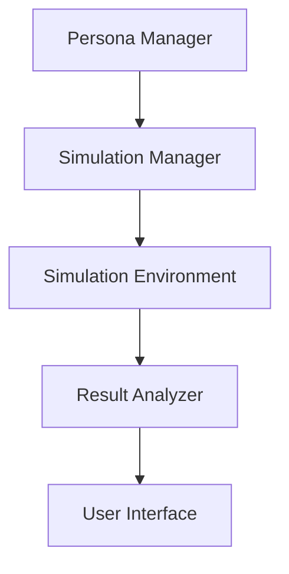

# System Architecture - Persimu

## File and Directory Structure

```
persimu/
├── docs/                    # System documentation
│   ├── README.md           # Main documentation
│   ├── deployment.md       # Deployment plan
│   └── architecture.md     # Architecture documentation
├── scripts/                # JavaScript files
│   ├── main.js            # Main entry point
│   ├── persona-manager.js # Persona management
│   ├── simulation-manager.js # Simulation management
│   ├── simulation-analytics.js # Result analysis
│   ├── simulation-environment.js # Simulation environment
│   └── demo.js            # Demo management
├── styles/                 # CSS files
│   ├── main.css           # Main styles
│   └── demo.css           # Demo styles
├── data/                   # Data files
│   ├── personas/          # Persona data
│   └── scenarios/         # Simulation scenarios
└── index.html             # Home page
```

## Data Flow

### Simulation Process
1. **Initialization**
   - Load personas
   - Set up environment
   - Prepare scenario

2. **Execution**
   - Run simulation
   - Manage interactions
   - Save results

3. **Analysis**
   - Process data
   - Generate insights
   - Display results

### Data Flow Between Components


## Component Relationships

### Persona Manager
- **Role**: Manage virtual personas
- **Dependencies**: None
- **Dependent on by**: Simulation Manager

### Simulation Manager
- **Role**: Manage simulation processes
- **Dependencies**: Persona Manager
- **Dependent on by**: Simulation Environment

### Simulation Environment
- **Role**: Create virtual environment
- **Dependencies**: Simulation Manager
- **Dependent on by**: Result Analyzer

### Result Analyzer
- **Role**: Analyze simulation data
- **Dependencies**: Simulation Environment
- **Dependent on by**: User Interface

## System Extension

### Adding New Functionality
1. **Add New Component**
   - Create new file
   - Define interface
   - Integrate with existing components

2. **Extend Existing Component**
   - Add functions
   - Update interfaces
   - Maintain compatibility

### Modifying Existing Components
1. **Interface Changes**
   - Update function signatures
   - Add parameters
   - Change return values

2. **Logic Changes**
   - Modify algorithms
   - Add checks
   - Improve performance

### External System Integration
1. **Add API**
   - Define endpoints
   - Manage authentication
   - Handle errors

2. **Data Export**
   - Supported formats
   - Export scheduling
   - Version management

## Future Planning

### Planned Improvements
1. **Performance**
   - Query optimization
   - Data caching
   - Parallel processing

2. **Functionality**
   - Complex persona support
   - Advanced analysis
   - Advanced visualization

### Possible Extensions
1. **User Interface**
   - Mobile support
   - Custom themes
   - Improved accessibility

2. **Analytics**
   - Machine learning
   - Behavior prediction
   - Smart recommendations 