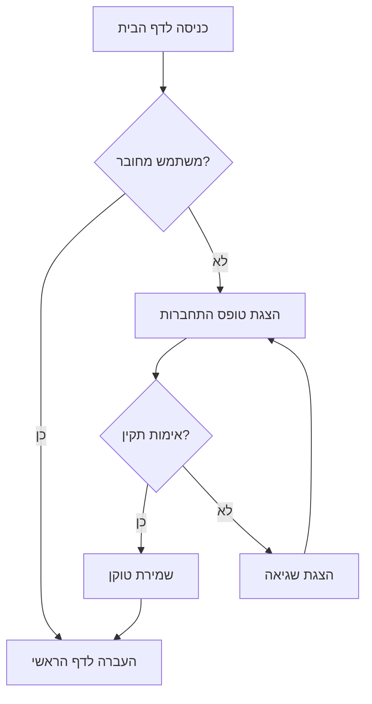
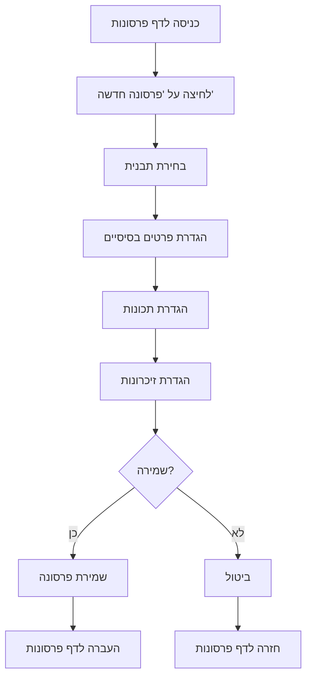
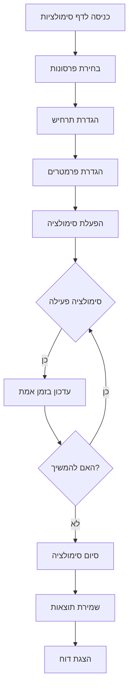
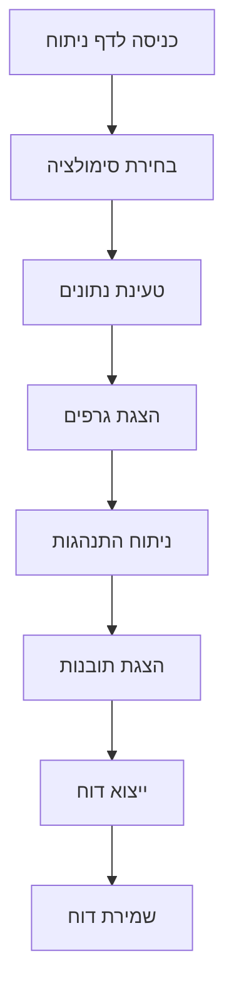
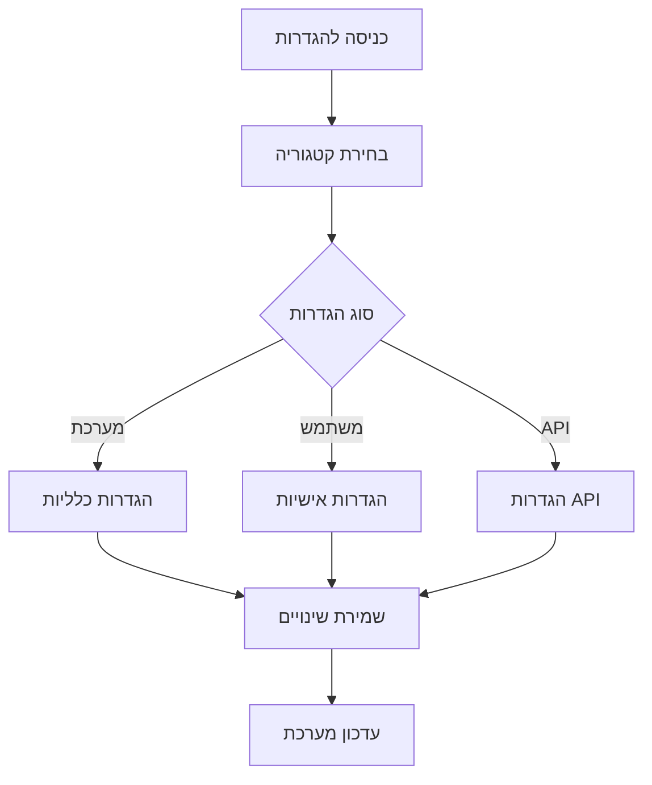
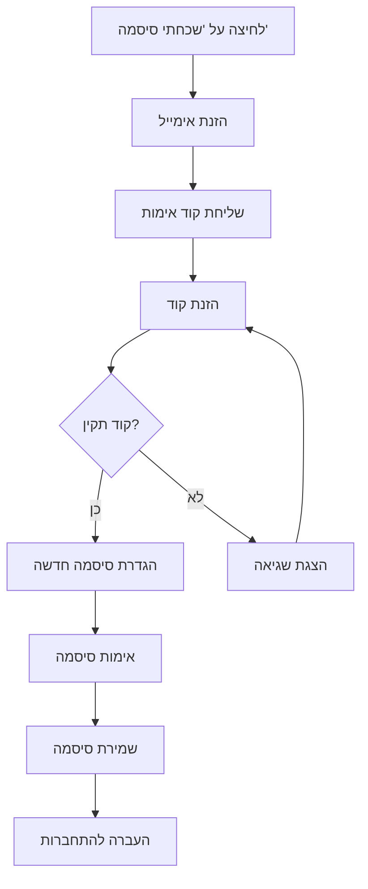
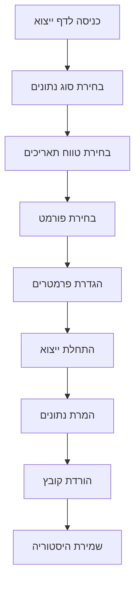
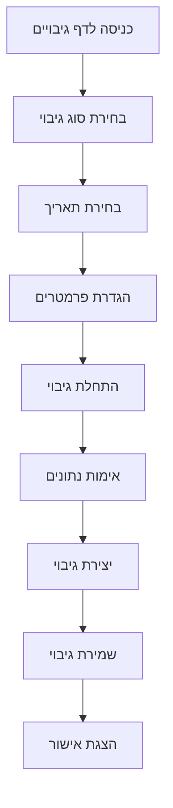
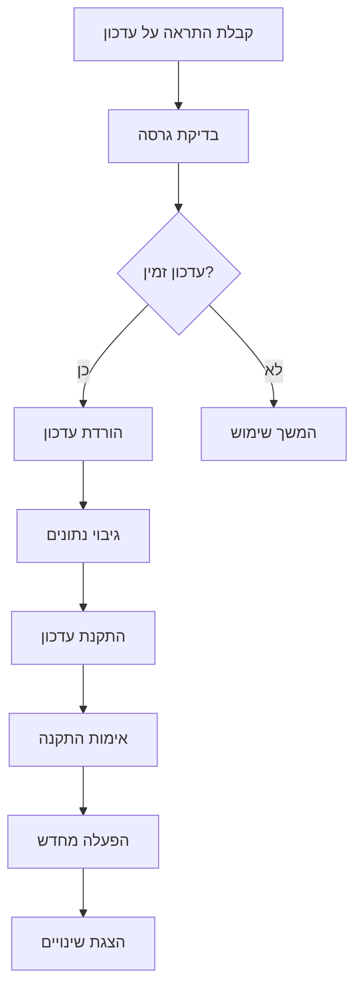
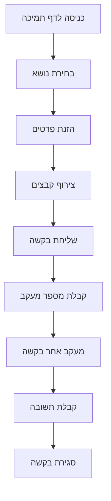

# תרשימי זרימה - תהליכי משתמש

## 1. תהליך התחברות

## 2. יצירת פרסונה חדשה

## 3. הפעלת סימולציה

## 4. ניתוח תוצאות

## 5. ניהול הגדרות

## 6. תהליך שחזור סיסמה

## 7. תהליך ייצוא נתונים

## 8. תהליך גיבוי

## 9. תהליך עדכון מערכת

## 10. תהליך תמיכה

